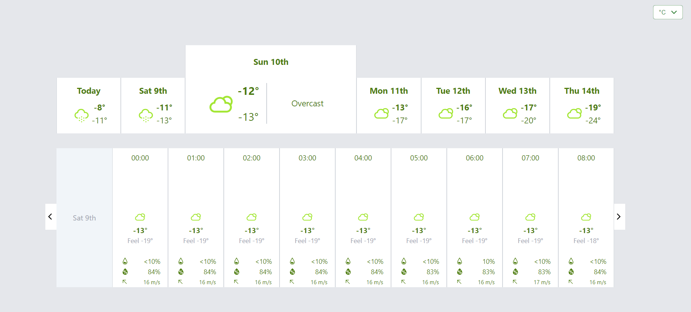

# Weather App

This project is developed as a technical assignment for the QT's trainee application. The Weather App is a web application that provides basic functionality to display weather data in Oulu (Finland). It presents the weather information in every hour and every day within 7 days, the user may choose the day on the daily table or can swipe the hourly table to see weather data displaying in detail. The app also allows users to change temperature unit from Celsius to Fahranheit, vice versa. 

# Link
https://weather-app-drab-nine-44.vercel.app/

## Features

- Display weather's daily data in Oulu in a table
- Swipe weather's hourly data in Oulu within a day. The increment or decrement of hourly data is illustrated in the swiping table by the height.
- Dropdown menu to change the temperature unit from Celsius to Fahranheit, or vice versa.

## Getting Started

Follow these instructions to set up and run the Weather App locally:

1. Clone the repository: `git clone https://github.com/ducquan190896/QT-assignment.git`
2. Navigate to the project directory: `cd QT-assignment`
3. Install the dependencies: `npm install`
4. Start the development server: `npm run dev`
5. Open your browser and visit `http://localhost:5173/` to access the Weather App.

Run Test:

1. Clone the repository: `git clone https://github.com/ducquan190896/QT-assignment.git`
2. Navigate to the project directory: `cd QT-assignment`
3. Install the dependencies: `npm install`
4. run Jest test by: `npm run test`

## Technologies Used

- React: JavaScript library for building user interfaces.
- Redux/Toolkit: JavaScript library for state management.
- TailwindCSS: styling.
- JavaScript
- Typescript
- HTML

## Image demo

## License

This project is licensed under the [MIT License](LICENSE).

